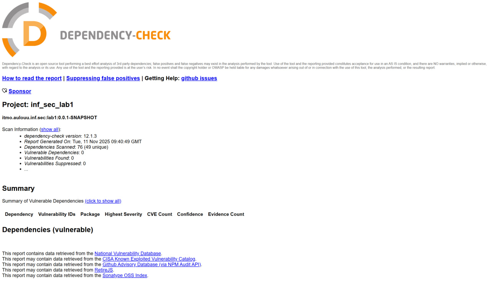

# Information Security Lab #1, ITMO SE (Spring Boot/Java)

---

# Методы API

## 1. `POST /auth/login` — Аутентификация пользователя

**Описание:**
Метод принимает логин и пароль пользователя. В случае успешной аутентификации возвращает JWT-токен.

**Request:**

```http
POST /auth/login
```

```json
{
  "username": "user",
  "password": "password"
}
```

**Response (JSON):**

```json
{
  "token": "eyJhbGciOiJIUzI1NiIsInR5...",
  "isAdminRole": false
}
```

**Ошибки:**

* `403 Forbidden` — если логин/пароль неверны.

---

## 2. `GET /api/data` — Получение списка домашних животных

**Описание:**
Возвращает список сущностей `Pet`. Доступ только для аутентифицированных пользователей (с валидным JWT).

**Request:**

```http
GET /api/data/list
Authorization: Bearer <JWT>
```

**Response (JSON):**

```json
[
  {
    "id": 0,
    "name": "Cat",
    "species": "Cat",
    "age": 3,
    "owner": "Alina Minkova",
    "description": "Description"
  }
]
```

**Ошибки:**

* `403 Forbidden` — если отсутствует или невалиден JWT.

---

## 3. `POST /api/data` — Добавление нового домашнего животного

**Описание:**
Добавляет новую сущность `Pet` в список. Доступ только для аутентифицированных пользователей.

**Request:**

```http
POST /api/data
Authorization: Bearer <JWT>
```

```json
{
  "id": 0,
  "name": "Dog",
  "species": "Dog",
  "age": 5,
  "owner": "Alina Minkova",
  "description": "Description"
}
```

**Response:**

```
OK
```

**Ошибки:**

* `400 Bad Request` — если данные невалидны.
* `403 Forbidden` — если отсутствует или невалиден JWT.

# Меры защиты

API использует **JWT-токены** для защиты эндпоинтов.

* Пользователь проходит аутентификацию через `POST /auth/login`.
* В ответ получает `token` (JWT).
* Для доступа к защищённым эндпоинтам необходимо передавать токен в заголовке:

```http
Authorization: Bearer <JWT>
```

## Противодействие SQL Injection (SQLi)

* Используется **Spring Data JDBC**, который применяет **параметризованные запросы** → данные подставляются безопасно, без конкатенации SQL-строк.
* Таким образом, классические SQLi невозможны.

## Противодействие XSS

* REST API возвращает **только JSON** и не исполняет JavaScript.
* Устанавливаются заголовки HTTP `X-XSS-Protection`: `1; mode=block` и `Content-Security-Policy`: `script-src 'self'`

## Реализация аутентификации

* Используется **JWT-токен**, который подписывается секретным ключом.
* Токен проверяется middleware (Spring Security `OncePerRequestFilter`).
* Без токена доступ к защищённым эндпоинтам запрещён.

# Скриншот отчета OWASP


# Результат SpotBugs
[XML файл](spotbugsXml.xml)
```xml
<FindBugsSummary num_packages='8' total_classes='23' total_size='430' clock_seconds='3.40' referenced_classes='193'
                 vm_version='21.0.9+10-LTS' total_bugs='0' java_version='21.0.9' gc_seconds='0.03'
                 alloc_mbytes='512.00' cpu_seconds='11.06' peak_mbytes='233.71'
                 timestamp='Tue, 11 Nov 2025 10:00:26 +0000'>
```
